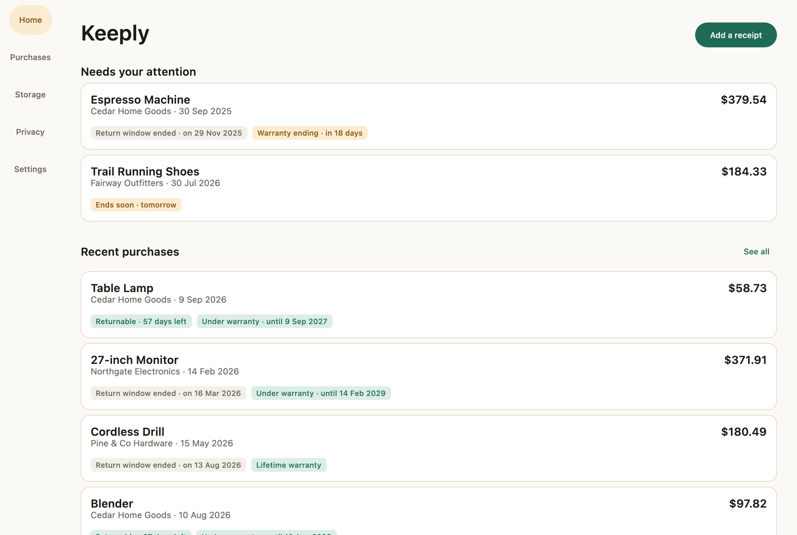
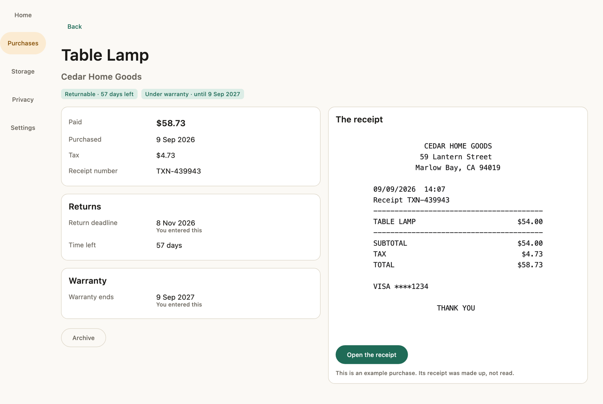
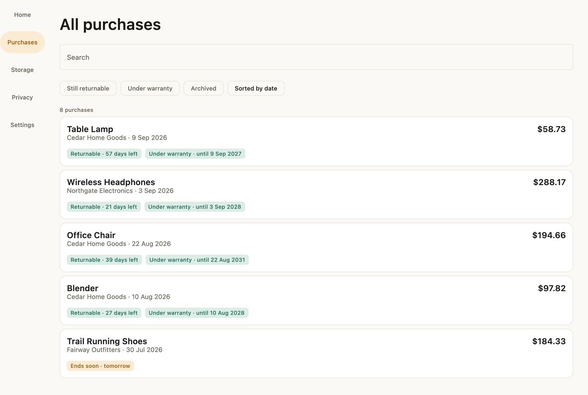
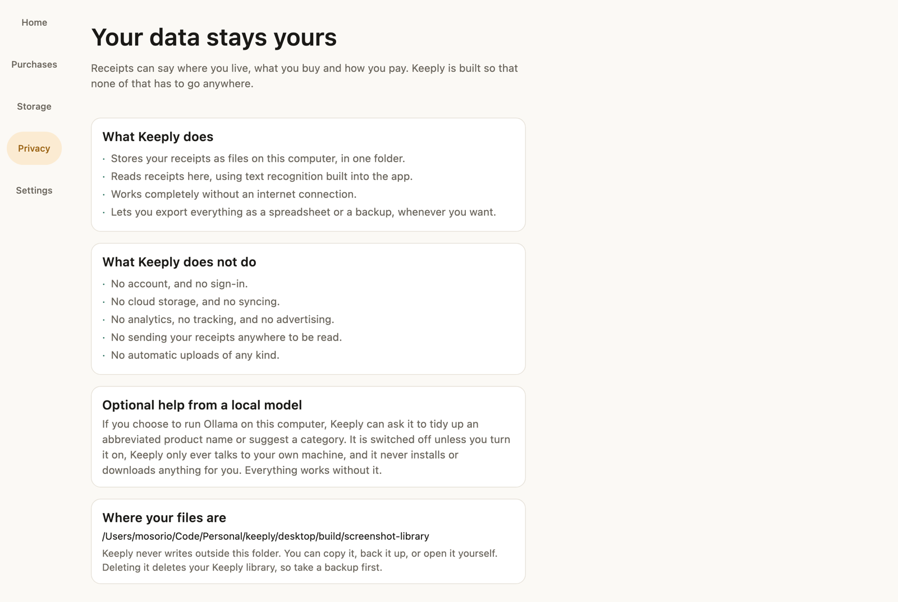

# Keeply

**Know what you bought, where the receipt is, and how long you have to return it.**

Keeply is a desktop application that keeps your receipts, tracks return windows
and warranty expiry, and lets you find any purchase in seconds.

Everything happens on your computer. No account, no cloud, no subscription, and
nothing is sent anywhere to be read.



---

## What it does

**Reads your receipts.** Drop a photo or a PDF on the window. Keeply straightens
a photographed page, reads the text, and pulls out the shop, the date, the total,
the tax and the items.

**Shows you what it read before saving anything.** The receipt sits beside the
fields, anything Keeply was unsure of says so, and a field it could not read is
left empty rather than filled with a guess.



**Tracks return windows.** Keeply knows how long you have left, and where that
deadline came from. A window printed on the receipt and a rule you saved for a
shop are different things, and Keeply says which one it is using.

**Tracks warranties.** Duration, explicit end date, lifetime, or unknown. It
distinguishes what a document said from what you typed from what it suggested.

**Finds things.** Search covers product names, shops, your notes, your tags and
the text read off the receipt, so you can find a purchase by a model number you
never typed. It also understands a small vocabulary: `returnable`, `warranty`,
`2026`, `under 100`, `this month`.



**Reminds you, locally.** Keeply can tell you when a return window is about to
close. There is no push service, no token, and nothing about your purchases
leaves the machine to make a notification appear.

**Lets you leave.** Export as a spreadsheet or JSON at any time, and back
everything up into one portable file that restores your receipts as well as
their details.

---

## Your data stays yours



Receipts say where you live, what you buy and how you pay. Keeply is built so
none of that has to go anywhere.

- Receipts are stored as files in **one folder on your computer**.
- Text recognition runs **on your machine**, using an engine shipped inside the
  application.
- **No account, no sign-in, no cloud, no syncing.**
- **No analytics, no tracking, no advertising, no telemetry.**
- Keeply **works with no internet connection at all**.

This is enforced, not just written down. The build fails if any module except the
optional local-AI one gains network access or an analytics dependency:

```bash
./gradlew privacyGuard
```

Optional help from a local model is available if you choose to run
[Ollama](https://ollama.com) yourself. It is off by default, Keeply only ever
talks to your own machine, it never installs or downloads anything for you, and
everything works without it. See [PRIVACY.md](PRIVACY.md).

---

## Installing

Download `Keeply-<version>-apple-silicon.dmg` or `Keeply-<version>-intel.dmg`
from [the latest release](https://github.com/mateoosoriodelhonte/keeply/releases),
open it, and drag Keeply to your Applications folder.

**The first time you open it, macOS will refuse.** The application is not signed
with an Apple Developer certificate, because this is an open-source project
without one. To open it anyway: right-click Keeply in Applications, choose
**Open**, and confirm. You only need to do this once.

That is a real limitation and not a formality. It is described in full, including
how to verify what you downloaded, in
[docs/LOCAL_DEVELOPMENT.md](docs/LOCAL_DEVELOPMENT.md#macos-and-unsigned-applications).

Or build it yourself:

```bash
./gradlew :desktop:packageDistributionForCurrentOS
```

---

## How it works

```
Receipt or PDF
      │
      ▼
Safe import ─────────────► original stored, never modified
      │
      ▼
Image preprocessing ─────► only when it helps, measured
      │
      ▼
Text ────────────────────► the PDF's own text if it has one, otherwise OCR
      │
      ▼
Deterministic parser ────► merchant, date, total, tax, items
      │
      ▼
You check it ────────────► nothing is saved until you say so
      │
      ▼
SQLite and local files
      │
      ├── search
      ├── return windows
      ├── warranties
      └── reminders
```

The optional local model sits outside this entirely. Nothing on the correctness
path calls it.

[ARCHITECTURE.md](ARCHITECTURE.md) has the full picture.

---

## How well does it read receipts?

Measured, not asserted. These come from running
[`OcrAccuracyTest`](core/ocr/src/test/kotlin/app/keeply/ocr/OcrAccuracyTest.kt)
and
[`ExtractionAccuracyTest`](core/extraction/src/test/kotlin/app/keeply/extraction/ExtractionAccuracyTest.kt)
against generated receipts whose exact contents are known.

**Text recognition**, character similarity against the known text:

| receipt layout | similarity |
| --- | --- |
| till roll | 99.6% |
| aligned columns | 100% |
| compact slip | 98.6% |
| printed invoice | 99.6% |

A receipt takes 60 to 130 ms to read on an Apple silicon machine.

| how it was captured | similarity |
| --- | --- |
| clean scan | 98.8% |
| faded thermal paper | 99.2% |
| photographed at an angle | 99.6% |
| out of focus | 95.4% |

**Field extraction**, on a 40-receipt corpus spanning four layouts, two tax
arrangements, four date formats and two currencies: the total, the shop, the
date, the receipt number, the tax and the item count were each read correctly on
every receipt.

These are Keeply's own generated receipts, which are clean, English, and
unrealistically consistent. A crumpled receipt photographed in a dim kitchen will
do worse. That is the honest caveat, and it is why nothing is saved without you
looking at it first. [docs/OCR_PIPELINE.md](docs/OCR_PIPELINE.md) explains the
method and what preprocessing measurably does and does not help.

---

## Is it fast?

On a library of 2,000 purchases, which is more than someone saving a receipt a
day for five years would have:

| | |
| --- | --- |
| opening Keeply | 4 ms |
| searching | 5 ms |
| filtering | 19 ms |
| importing a photographed receipt, including reading it | 288 ms |

Measured by
[`PerformanceTest`](core/services/src/test/kotlin/app/keeply/services/PerformanceTest.kt),
on an Apple silicon machine. Reading a receipt happens in the background: the
window stays usable, shows what it is doing, and can be stopped.

---

## Built with

| | |
| --- | --- |
| **Kotlin** | A modern, strongly typed language that suits domain engineering. The rules about money, dates and deadlines are pure functions with no I/O. |
| **Compose Multiplatform** | A native-feeling desktop interface without Electron and without Swift, architected so Windows and Linux are a build target rather than a rewrite. |
| **SQLite** with SQLDelight | Private, structured, local data with no server, and SQL checked at compile time. Full-text search comes from FTS5. |
| **Tesseract** | Text recognition that runs on your machine. Keeply ships the engine and the language model, so nothing is installed and no receipt is uploaded. |
| **OpenCV** | Straightens a photographed page before reading it, which measurably improves the result. Used where it helps and nowhere else. |

macOS is the tested platform. The full test suite also runs on Linux in CI, but
Keeply has not been tested as a packaged application there or on Windows, so
neither is claimed as supported.

---

## Documentation

| | |
| --- | --- |
| [ARCHITECTURE.md](ARCHITECTURE.md) | How the pieces fit, and why they are separate |
| [PRIVACY.md](PRIVACY.md) | Exactly what Keeply does and does not do with your data |
| [SECURITY.md](SECURITY.md) | How untrusted files are handled, and how to report a problem |
| [docs/OCR_PIPELINE.md](docs/OCR_PIPELINE.md) | Reading a receipt, and what the measurements showed |
| [docs/DATA_MODEL.md](docs/DATA_MODEL.md) | The schema, and the rules encoded in it |
| [docs/BACKUPS.md](docs/BACKUPS.md) | The archive format, and what a restore refuses |
| [docs/LOCAL_DEVELOPMENT.md](docs/LOCAL_DEVELOPMENT.md) | Building, testing and packaging |
| [CONTRIBUTING.md](CONTRIBUTING.md) | How to work on Keeply |
| [CHANGELOG.md](CHANGELOG.md) | What changed |

---

## License

[MIT](LICENSE)
